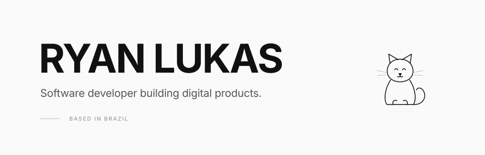

  

  
  
  

 

## Sobre mim

Sou desenvolvedor **full stack**. Construo do banco de dados até a interface: aplicações web, sistemas internos, CRMs, dashboards e automações que rodam sozinhas.

Comecei resolvendo o problema de gente talentosa perdendo o dia inteiro em tarefa repetitiva — e continuo com a mesma régua: se dá pra transformar em um clique, transformo. Hoje isso vai desde um scraper em Python até um sistema completo em Next.js com autenticação, painel e API.

Não corro atrás de hype de tecnologia. Corro atrás de coisa que funciona, entrega e devolve horas pra quem usa.

 

## Stack

**Front-end**

**Back-end & Dados**

**Automação & Ferramentas**

 

## O que eu construo

**Aplicações web** — sites e sistemas completos em React / Next.js, com API, banco, autenticação e deploy. Interface que qualquer pessoa consegue usar sem manual.

**Sistemas & CRM** — painéis de gestão, controle de clientes, relatórios e integrações. Feito sob medida pro processo de quem vai usar, não o contrário.

**Automação** — web scraping, bots de preenchimento de formulário, tratamento de planilha e geração automática de relatório. O trabalho de uma tarde virando um script que roda em segundos.

 

## GitHub

  
  

 

  <i>código nunca fica pronto — só fica menos terrível com o tempo</i>

